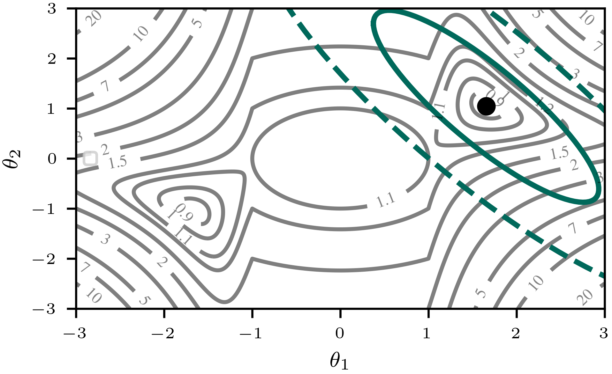

<p align="center">
  
</p>

---
[](https://www.python.org/downloads/release/python-3110/)
[](https://github.com/laplax-org/laplax/actions/workflows/test.yaml) [](https://github.com/laplax-org/laplax/actions/workflows/docs.yaml) [](https://coveralls.io/github/laplax-org/laplax?branch=laplax_api)

> Laplace Approximations in JAX.

The `laplax` package provides a performant, minimal, and practical implementation of Laplace approximation techniques in [`jax`](https://github.com/google/jax). The package is designed to support a wide range of scientific libraries, initially focusing on compatibility with popular neural network libraries such as [`equinox`](https://github.com/patrick-kidger/equinox), [`flax.linen`](https://github.com/google/flax/tree/main/flax/linen), and [`flax.nnx`](https://github.com/google/flax/tree/main/flax/nnx). Our goal is to create a flexible tool for both practical applications and research, enabling rapid iteration and comparison of new approaches.

## Installation
Use `pip install laplax`.

## Minimal example

The following [tiny `laplax` example](examples/0000_tiny_laplax.ipynb) shows how to use the `laplax` package to perform a linearized Laplace approximation on a two-parameter ReLU network $\mathcal{D}(x,\theta)=\theta_2\,\text{ReLU}(\theta_1 x+1)$ for $\mathcal{D}=\{(1,-1),(-1,-1)\}$ and visualize the weight space uncertainty in the loss landscape.

<div style="display: flex; flex-direction: column; align-items: center; margin: 2em 0;">
  
</div>

Gray contours: energy with square loss; black dot: optimum $\theta^*$; green ellipses: $1\sigma$ and $2\sigma$ levels of the Laplace approximation.


```python
from jax.nn import relu
from jax.numpy import array
from laplax import laplace
from plotting import plot_figure_1

# You need a model...
def model_fn(input, params):
    return relu(params["theta1"] * input - 1) * params["theta2"]
params = { # optimized weights,
    "theta1": array(1.6556547), "theta2": array(1.0420421)
}
data = {  # and training data.
    "input": array([1., -1.]), "target": array([1., -1.])
}

# ... then apply laplax ...
posterior_fn, _ = laplace(
    model_fn, params, data, loss_fn="mse", curv_type="full",
)
curv = posterior_fn({"prior_prec": 0.2}).state['scale']

# ... to get Figure 1.
plot_figure_1(model_fn, params, curv)
```

## Overview

We provide a high-level interface for performing Laplace approximation on a model and expose additional is low-level building blocks. As working examples, we include both approaches as tutorials:

- [Tiny example](examples/0000_tiny_laplax.ipynb) (cf. plot above)
- [Laplax for regression](examples/0001_laplax_for_regression.ipynb)
- [Laplax on MNIST](examples/0002_laplax_on_mnist.ipynb)

Both APIs and all available options are documented in the [Manual](api.md). For each submodule, we provide a short overview as well as a comprehensive list of all available functions.

For a general starting point for details on Laplace approximation and our notations, we refer to the [Background](background.md) section.
Most of the documentation follows our recent workshop paper.


## Citation

If you use `laplax` in your research, please cite for now:

```bibtex
@software{laplax,
    author = {Tobias Weber, Bálint Mucsányi, Lenard Rommel, Thomas Christie, Lars Kasüschke, Marvin Pförtner, Philipp Hennig},
    title = {Laplax: Laplace Approximations in JAX},
    year = {2025},
    publisher = {GitHub},
    journal = {GitHub repository},
    howpublished = {\url{https://github.com/laplax-org/laplax}},
}
```
